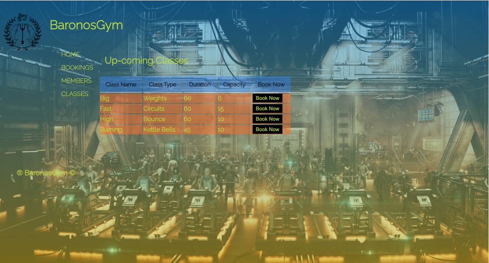

## Baronons Gym App

### Brief
A local gym has asked you to build a piece of software to help them to manage memberships, and register members for classes.

#### MVP

- The app should allow the gym to create and edit Members
- The app should allow the gym to create and edit Classes
- The app should allow the gym to book members on specific classes
- The app should show a list of all upcoming classes
- The app should show all members that are booked in for a particular class

#### Possible Extensions

- Classes could have a maximum capacity, and users can only be added while there is space remaining.
- The gym could be able to give its members Premium or Standard membership. Standard members can only be signed up for classes during off-peak hours.
- The Gym could mark members and classes as active/deactivated. Deactivated members/classes will not appear when creating bookings. 

#### Rules

The project must be built using only:

* HTML / CSS
* Python
* Flask
* PostgreSQL and the psycopg

It must **NOT** use:

* Any Object Relational Mapper (e.g. ActiveRecord)
* JavaScript. At all. Don't even think about it.
* Any pre-built CSS libraries, such as Bootstrap.
* Authentication. Assume that the user already has secure access to the app.

### Outcome

The project met all MVP requirements with some custom extensions.


### Highlights

- Clearer comprehension of the links between different models/views (Back-end, front end…Fullstack);
- Concept generation and format visualisation;
- Planning & Evaluation;
- Overarching processes;
- Styling;
- Functional routes and end logic.




### Better-if:

- Managed time / commitments better (2 young children really eat up the weekend);
- Looked more futuristic / sci-fi;
- Used grid template;
- Built more functionality into data presented coupled with add-ons;
- Used dates/time, class capacity, membership, Calendar views, Trainers,Performance Streaks (target classes based on behaviour);
- Better colour pallet.


### Possible next steps to improve app

- Build on Python functionality and capability to make app more efficient;
- Re-build app in react to utilise sci-fi frameworks.


## How to run the App (reminder)

- cd into root folder of Gym app
```bash
#terminal

  cd gym_app
```


- Run database in terminal:

```bash
#terminal

  psql -d gym_manager -f db/gym_manager.sql
```
(-d; database select)

(-f; file to run in context of selected database)

- Run Flask:

```bash
# terminal

  flask run 
```


- Run app in a seprate terminal:

```bash
#in another terminal

  python3 console.py
```